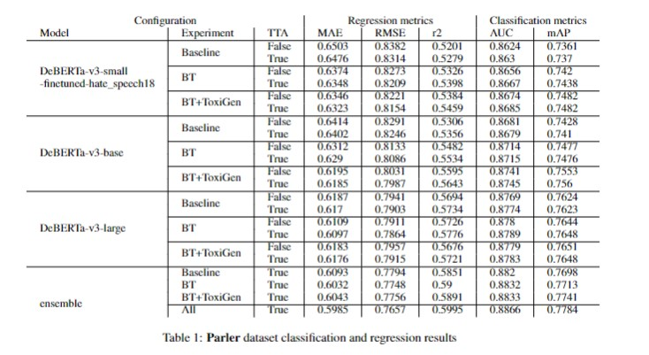

# Social Network Hate Detection: Finding Social Media Posts Containing Hateful Information Using Ensemble Methods and Back-Translation
Recent research efforts have been directed to- ward the development of automated systems for detecting hateful content to assist social media providers in identifying and removing such con- tent before it can be viewed by the public. This paper introduces a unique ensemble approach that utilizes DeBERTa models, which benefits from pre-training on massive synthetic data and the integration of back-translation techniques during training and testing. Our findings re- veal that this approach delivers state-of-the- art results in hate-speech detection. The re- sults demonstrate that the combination of back- translation, ensemble, and test-time augmen- tation results in a considerable improvement across various metrics and models in both the Parler and GAB datasets. We show that our method reduces models’ bias in an effective and meaningful way, and also reduces the RMSE from 0.838 to around 0.766 and increases R- squared from 0.520 to 0.599. The biggest im- provement was seen in small Deberate models, while for large models, there was either a minor improvement or no change.

## pipline

## methood

### Back-Translation

### Test Time Augmentation

### Ensemble

## results

## Install
clone our repo
```
git clone https://github.com/OrKatz7/parler-hate-speech
cd parler-hate-speech
```
install fastText
```
git clone https://github.com/facebookresearch/fastText.git
cd fastText
pip install .
cd ..
```
install requirements
```
pip install -U easynmt
pip install thai-segmenter
pip install -U protobuf==3.20.0
pip install -U iterative-stratification==0.1.7
pip install -U transformers==4.21.2
pip install -U tokenizers==0.12.1
```
export
```
export PROTOCOL_BUFFERS_PYTHON_IMPLEMENTATION=python
```
## How To Run
clasic tf-idf
```
train-tfidf.ipynb
```
back translation
```
back_translation.ipynb
```
train
```
train simple NN like Bert, Robereta or Deberta from Hugging Face - train_nn.ipynb
train all 5 models that we used from Hugging Face - ./run_train.sh
```
stage 2 - train lgbm
```
train a lgbm model on Hugging Face{Bert,Roberta or Deberta} embeddings - stage2train.ipynb
```
